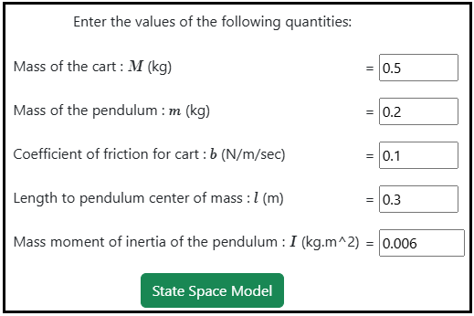
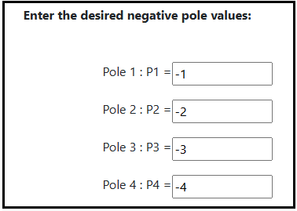
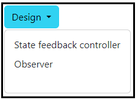
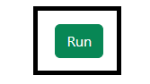
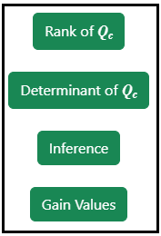
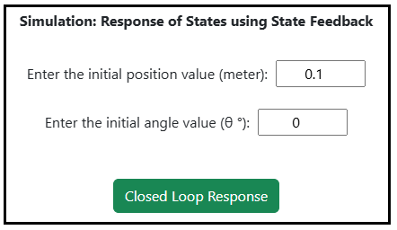
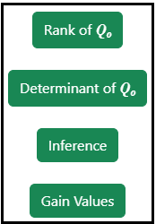
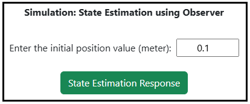

### Procedure

<b>Steps to perform the simulation</b>

<ol type="1">

<li> Enter the parameter values of the Inverted Pendulum on cart.</li> 

  
<b>Fig. 1. Parameter values of the Inverted pendulum on cart</b> 						  

 

<li> Click on 'State Space Model' button to get the state space form of the system.</li> 

   
<b>Fig. 2. Button to get the state Space form of the system</b> 						  

 
                
<li> Click on ' Enter the Pole Location' button to enter the desired pole values. </li> 

  
<b>Fig. 3. Button to enter the desired pole values </b> 						  

 

<li> Enter the desired pole values. </li> 

  
<b>Fig. 4. The desired pole values </b> 						  

 

<li> Click on 'Design' dropdown button and select the desired option for calculating the design. </li> 

  
<b>Fig. 5. Dropdown button for selecting the required design option </b> 						  

 
<li> Click on the 'Run' button to run the selected design. </li> 

  
<b>Fig. 6. Run button to calculate the selected design </b> 						  

 

<li> Click on the 'Rank' or 'Determinant'  or "Inference' buttons to get the the Controllability test information and state feedback gain values. </li> 

  
<b>Fig. 7. Rank, Determinant and Inference of the Controllability test </b> 						  

  

<li> Enter the required values and click on the 'Closed Loop Response' button to generate the plot.</li> 

  
<b>Fig. 8. Closed Loop Response button to get the plot </b> 						  

  

<li> <b>Note for State Feedback:</b> Enter the initial position value between -10 m to +10 m and enter the initial angle value between -6 &deg; to +6 &deg; (as per the practical experiment point of view). Click on the "Closed Loop Response" button.</li> 

<li> Click on the 'Rank' or 'Determinant'  or "Inference' buttons to get the the Observability test information and observer gain values. </li> 

  
<b>Fig. 9. Rank, Determinant and Inference of the Observability test </b> 						  

 

<li> Enter the required values and click on the 'State Estimation Response' button to generate the response plot.</li> 

  
<b>Fig. 10. State Estimation Response button to get the plot </b> 						  

 

<li> <b>Note for Observer:</b> Enter the initial position value between -10 m to +10 m (as per the practical experiment point of view). Click on the "State Estimation Response" button.</li> 

<li> Click on 'Download' button to download the plot.</li> 

<li> Click on 'Clear' button to enter the new parameter values of the system.</li>  

</ol>

