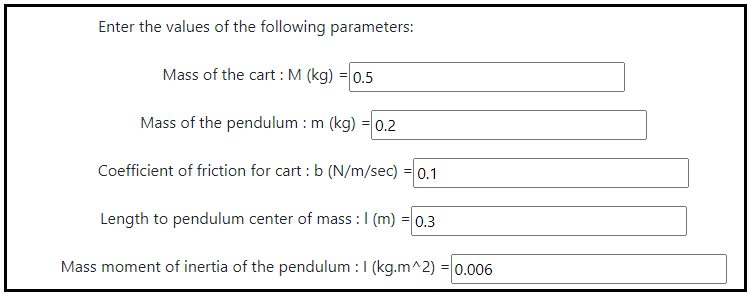
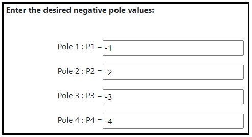
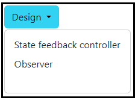
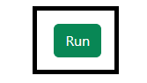
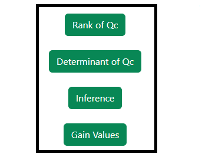
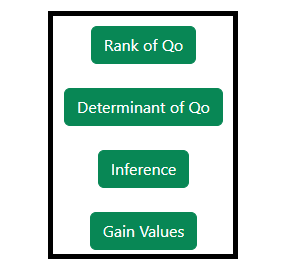

### Procedure

<b>Steps to perform the simulation</b>

										
1. Enter the parameter values of the Inverted Pendulum on cart.

<b>Fig. 1. Parameter values of the Inverted pendulum on cart</b>						  

2. Click on 'State Space Model' button to get the state space form of the system.

           

<b>Fig. 2. Button to get the state Space form of the system</b>							  

                    
3. Click on ' Enter the pole Location' button to enter the desired pole values. 

<b>Fig. 3. Button to enter the desired pole values </b>						  

4. Enter the desired pole values. 

<b>Fig. 4. The desired pole values </b>						  

5. Click on 'Design' dropdown button and select the desired option for the design. 

<b>Fig. 5. Dropdown button for selecting the required design option </b>						  

6. Click on the 'Run' button to run the selected design. 

<b>Fig. 6. Run button to calculate the selected design </b>						  

7. Click on the 'Rank' or 'Determinant'  or "inference' buttons to get the the Controllability test information and state feedback gain values. 

 
<b>Fig. 7. Rank, determinant and inference of the Controllability test </b>						  

8. Click on 'Design' dropdown button and select the desired option for calculating the design. 

<b>Fig. 8. Dropdown button for selecting the required design option </b>				  

9. Click on the 'Rank' or 'Determinant'  or "inference' buttons to get the the Observability test information and observer gain values. 

<b>Fig. 9. Rank, determinant and inference of the Observability test </b>						  

10. Click on 'Clear' button to enter the new parameter values of the system. 

