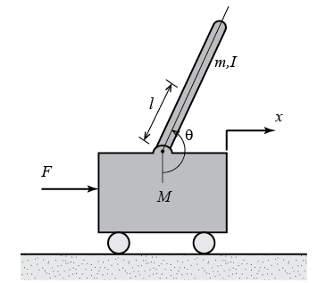

# Theory

Linear time invariant system may be represented in state space form by the following equations:
State equation:
$$ \dot{x}(t)=A x(t)+B u(t) \tag{1a} $$
Output equation:
$$ y(t)= C x(t) u(t) \tag{1b} $$
<b><i>State feedback design:</i></b>  
A necessary and sufficient condition for arbitrary pole placement is that the pair (A, B) must be controllable. 
Control input:
$$ u(t)= - K x(t) \tag{2} $$
where, K is the state feedback gain vector,i.e.,
$$ K = [k_1 \ k_2 \ ... \ k_n]  $$
With this control input, the closed loop system is as follows:
$$ \dot{x}(t)=(A-BK) x(t)  $$
The characteristic equation of the closed loop system is,
$$ |sI-(A-BK)|=0  $$
For nth order system, the characteristic equation is,
$$ s^n + k_n s^{n-1} + k_{n-1} s^{n-2} + ... + k_1=0 \tag{3} $$
The desired closed loop poles are P1, P2, P3, ... , Pn.
Then the desired characteristic equation is:
$$ (s-P_1)(s-P_2)(s-P_3)...(s-P_n)=0 \tag{4} $$
The required state feedback gain (K) vector elements are obtained by comparing the matching coefficients of (3) and (4).
  

<b><i>Observer design:</i></b>  
A state observer estimates the state variables based on the measurements of the output and control variables. Here the concept of observability plays an important role. 
State observers can be designed if and only if the observability condition is satisfied. 
The mathematical model of the observer is basically the same as that of the plant, except that we include an additional term that includes the estimation error to compensate for inaccuracies in matrices A and
B and the lack of the initial error. 
The estimation error or observation error is the difference between the measured output and the estimated output. The initial error is the difference between the initial state and the initial estimated state.
The mathematical model of the observer:
$$ \dot{\tilde{x}}(t)=A \tilde{x}(t)+B u(t) + K_e (y - C \tilde {x}(t)) \tag{5} $$
$$ where, \tilde {x}(t) \ is \ estimated \ state \ vector, C \tilde{x}(t)\ is \ estimated \ output \ and \ K_e \ is \ an \ observer \ gain \ matrix. $$
From (1) and (5), the observer error equation is,
$$ \dot{x}(t) - \dot{\tilde{x}}(t)= (A x(t) + B u(t) ) - ( A \tilde{x}(t)+B u(t) + K_e (y - C \tilde {x}(t)))  $$
$$ \dot{x}(t) - \dot{\tilde{x}}(t)= (A x(t) + B u(t) ) -  A \tilde{x}(t) - B u(t) - K_e ( C x(t) - C \tilde {x}(t)))  $$
$$ \dot{x}(t) - \dot{\tilde{x}}(t)= A ( x(t)  -  \tilde{x}(t)) + K_e C( x(t) -  \tilde {x}(t))) \tag{6} $$
The error is,
$$ e (t) = x(t) - \tilde {x}(t) \tag{7} $$

From (6) and (7),
$$ \dot {e}(t) = A e(t) - K_e C e(t) $$
$$ \dot {e}(t) = (A - K_e C) e(t) $$

If the plant is completely observable, then it can be proved that it is possible to choose matrix Ke
such that A-KeC has
arbitrarily desired eigenvalues. That is, the observer gain matrix Ke
can be determined to yield the desired matrix A-KeC.

  
<b><i>State Space Model of Inverted Pendulumn on cart:</i></b>  
The system consists of an inverted pendulum mounted to a motorized cart. Its popularity derives in part from the fact that it is unstable without control, that is, the pendulum will simply fall over if the cart isn't moved to balance it. 
Additionally, the dynamics of the system are nonlinear. The objective of the control system is to balance the inverted pendulum by applying a force to the cart that the pendulum is attached. A real-world example that relates directly to this inverted pendulum system is the attitude control of a booster rocket at takeoff. 
In this case we will consider a two-dimensional problem where the pendulum is constrained to move in the vertical plane shown in the figure below. For this system, the control input is the force F that moves the cart horizontally and the outputs are the angular position of the pendulum &theta; and the horizontal position of the cart x.  

         
<figcaption style="color:black"> Fig.1. Invereted Pendulum on Cart</figcaption>						  

 
where, M is mass of the cart (kg), m is mass of the pendulum (kg), 
b is coefficient of friction for cart (N/m/sec), l is length to pendulum center of mass (meters), I is mass moment of inertia of the pendulum (kg.m2)
F is force applied to the cart, x is cart position coordinate, &theta; is pendulum angle from vertical (down).  
The linearized equations of motion can also be represented in state-space form: 
Let &Phi; represent the deviation of the pedulum's position, u has been substituted for the input F.

   

 

